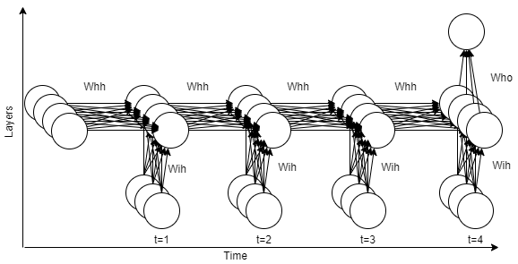
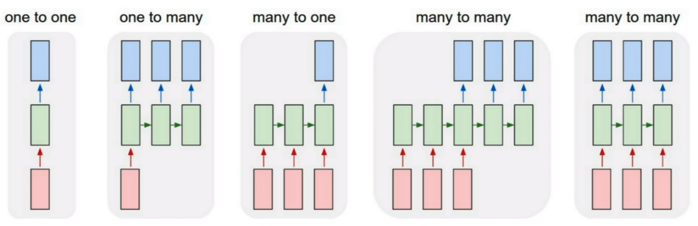

# Simple RNN (Vanilla RNN) 
Simple RNN is the most basic Recurrent Neural Network model, that has been widely used in many applications which contains sequential data. You can find the [SimpleRNN.py](https://github.com/bilkosem/simple-rnn_from_scratch/blob/master/SimpleRNN.py) file in the repo which implements the mathematical model of the Simple RNN from scratch. If you are interested with **mathematical model**, **backpropagation through time** and the **vanishing gradient**, keep reading the [tutorial file](https://github.com/bilkosem/simple-rnn_from_scratch/blob/master/simple-rnn_tutorial.pdf).

# Working Principle of RNNs

Recurrent Neural Networks, take their name from the recurrent connections that expands through the time axis in their model.
 
 

*Figure 1: General look of a Recurrent Neural Network unfolded through time using many-to-one architecture*

The depicted network contains three layers as it can be seen by looking at the “Layers” axis. It has 3 neurons in input layer, 4 neurons in hidden layer and 1 neuron in output layer. The other axis “Time” shows the amount of time steps in the input data. As a solid example, assume that there exists a data set which contains 3 different variable. About the data set, it is also known that the value of 3rd variable has a complex dependency with other two variables. As a multivariate time series forecasting application, it is wanted to predict next value of the 3rd variable by taking the last 4 value of all three variables into account. So, each node in the input layer corresponds to a variable category and each tick in time axis corresponds to a time step.
In the forward pass, for each time step t, hidden layer values of that time step are calculated as a function of input layer at time step t and hidden layer at time step t-1. Another key point about this structure is the weights. As it is written in the figure 1, all the occurrence of the weights Wih, Whh and Who is identical. Thus, for this particular example there only exists 3 kind of weight matrices which are shared through the time. As an initial condition, hidden layer at the time step 0 is filled with zeros and input vectors start to be given into network from time step 1.
The example in the paragraph above can be seen as a typical “many-to-one” application. It means that it takes an input with more than one time steps and gives only one output at the end of calculations through time. There also exist different applications such as “one-to-many” or “many-to-many” as it can be seen in the figure 2.

 

*Figure 2: Different working schemes of Recurrent Neural Networks [[1]](http://karpathy.github.io/2015/05/21/rnn-effectiveness/).*

